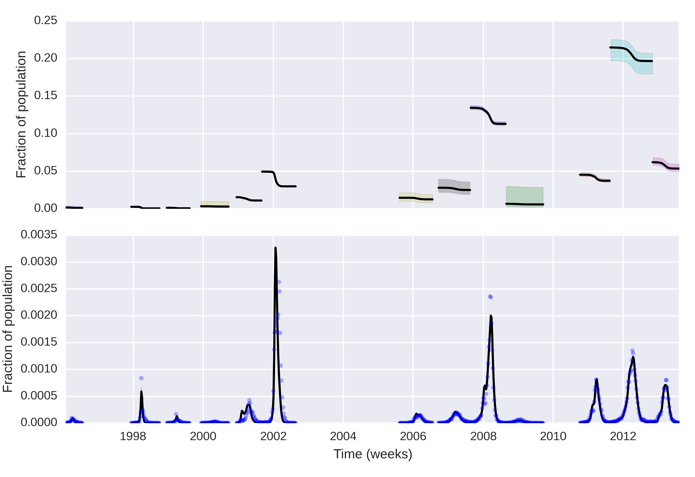

## Estimating the Attack Ratio of Dengue Epidemics from Aggregated Notification Data
Flavio Coelho1 and Luiz Max de Carvalho2  

1 School of Applied Mathematics, Getulio Vargas Foundation (FGV), Rio de Janeiro -- RJ, Brazil.

2 Program for Scientific Computing, Oswaldo Cruz Foundation, Rio de Janeiro -- RJ, Brazil.

### Quick Summary

In this paper we address the problem of learning about the attack ratio of a multi-strain disease like dengue.
We propose to inform time-varying transmission using the effective reproductive number R_t and propose a way to quantify uncertainty about its estimates.
We couple these developments with a Susceptible-Infectious-Removed (SIR) model and Bayesian parameter estimation implemented in [BIP](http://bayesian-inference.googlecode.com/hg/trunk/BIP/Docs/build/html/index.html) to calculate the attack ratio of dengue epidemics in Rio de Janeiro.

### Abstract ([Arxviv](http://arxiv.org/abs/1502.01236))

Quantifying the attack ratio of disease is key to epidemiological inference and Public Health planning.
For multi-serotype pathogens, however, different levels of serotype-specific immunity make it difficult to assess the population at risk. 
In this paper we propose a Bayesian method for estimation of the attack ratio of an epidemic and the initial fraction of susceptibles using aggregated 
incidence data. 
We derive the probability distribution of the effective reproductive number, R_t, and use MCMC to obtain posterior distributions of the parameters of a single-strain SIR transmission model with time-varying force of infection.
Our method is showcased in a data set consisting of 18 years of dengue incidence in the city of Rio de Janeiro, Brazil.
We demonstrate that it is possible to learn about the initial fraction of susceptibles and the attack ratio even in the absence of serotype specific data.
On the other hand, the information provided by this approach is limited, stressing the need for detailed serological surveys to characterise the distribution of serotype-specific immunity in the population.

**Dengue cases and the calculated R_t along with 95% confidence bands**
The intrinsic variability of R_t can be used to inform the time-varying force of infection, since it reflects variation in the vector population and other environmental factors such as temperature and seasonal variation.

**Posterior curves for the infectious and susceptibles**
The curves were estimated only for the periods where R_t> 1
It is clear that this simple model, despite its limitations fits the data well.
With the posterior curves of S_0 we can then learn about the attack ratio of every major epidemic in the city.
